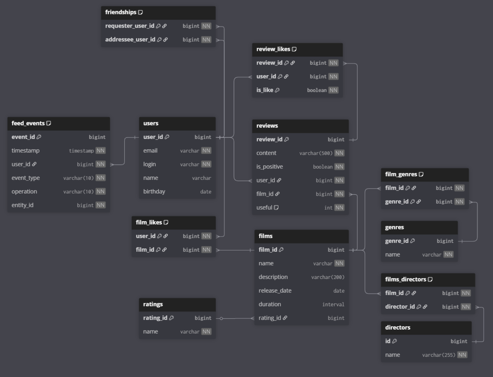

# java-filmorate

## Схема базы данных

### Таблицы

- **users** — пользователи: `email`, `login`, `name`, `birthday`
- **friendships** — дружба между пользователями с полем `status` (`pending`, `accepted`)
- **films** — фильмы: `name`, `description`, `release_date`, `duration`, `rating`
- **genres** — жанры фильмов
- **film_genres** — связь many-to-many между фильмами и жанрами
- **film_likes** — связь many-to-many между пользователями и фильмами (лайки)

### Перечисления

- `friendship_status`: `pending`, `accepted`
- `rating`: `G`, `PG`, `PG_13`, `R`, `NC_17`

> **Примечание:** Жанры реализованы через отдельную таблицу `genres`, а не enum, так как перечисления сложно расширять и
> редактировать в большинстве СУБД.